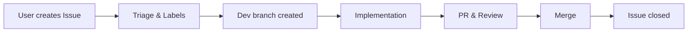

# Bank Support

<p align="center">
  <a href="https://bank.easyitlab.tech/">
    🌐 <b>Open Bank Education Platform</b>
  </a>
</p>

<p align="center">
  
  
  
  
  
</p>

<p align="center">
  <a href="https://bank.easyitlab.tech/">
    🚀 Open Platform
  </a>
  •
  <a href="../../issues">
    🐞 Report Bug
  </a>
  •
  <a href="../../issues/new/choose">
    💡 Request Feature
  </a>
  •
  <a href="../../discussions">
    💬 Discussions
  </a>
</p>

---

## 🚀 Quick Start

👉 Open the platform: https://bank.easyitlab.tech/  
👉 Found a problem? Create an Issue  
👉 Have a question? Start a Discussion  

---

## 🧭 Where to go?

| You want to... | Go here |
|----------------|--------|
| Report a bug | Issues |
| Request a feature | Issues |
| Ask a question | Discussions |
| Share an idea | Discussions |

---

## 💡 What is this repository?

This repository is the **official support and feedback channel** for the Bank platform.

Here you can:
- 🐞 report bugs
- 💡 suggest new features
- 🔐 report access issues
- 💳 ask about billing / provisioning
- ❓ ask questions about usage

---

## 🚨 Important Rules

Before creating an issue, please read carefully:

### ❌ Do NOT share:
- passwords
- API tokens or secret keys
- private/internal URLs
- database credentials
- personal data (yours or others)
- payment details (card numbers, etc.)

If your issue contains sensitive information — **do not create a public issue**.

---

### 🔐 Security Issues

If you found a vulnerability or security-related issue:
- ❌ do NOT post it publicly
- ✅ contact the project owner directly

---

## 📦 About the Platform

- 🌐 Main platform: https://bank.easyitlab.tech/
- 🔒 Source code is stored in a **private repository**
- 📢 This repo is used only for:
  - communication
  - issue tracking
  - feedback collection

---

## 🧩 Types of Requests

Please select the correct type when creating an issue:

| Type | Description |
|------|------------|
| 🐞 Bug report | Something is broken |
| 💡 Feature request | Suggest improvements |
| 🔐 Access problem | Login / permissions / provisioning |
| 💳 Billing | Payments / subscriptions |
| ❓ Question | General usage questions |

---

## 💬 Discussions vs Issues

### Use **Issues** for:
- bugs
- access problems
- billing issues
- concrete feature requests

### Use **Discussions** for:
- questions
- ideas
- feedback
- open-ended conversations

👉 Discussions may be converted into Issues if needed.

---

## 🔄 How We Work



1. A user creates an issue or discussion
2. The issue is triaged and labeled
3. A development branch is created in the private repository
4. Changes are implemented and linked to the issue
5. After merge, the issue is closed automatically

---

## 🔗 Linking Development to Issues

We use strict naming conventions for full traceability:

### Branch

```
fix/support-123-login-timeout
feature/support-145-export-csv
```

### Pull Request

```
Fix support #123: login timeout
```

### Commit

```
Fixes easyitlab/bank-support#123
```

✅ This provides:

* clear mapping between issue and code
* full traceability
* automatic issue closing

---

## ⚡ Response Expectations

* Issues are reviewed as soon as possible
* Priority depends on impact and severity
* Not all feature requests will be implemented
* Additional information may be requested

---

## 🧹 Issue Quality

To keep the repository clean:

* duplicates → closed as `duplicate`
* incomplete → marked as `needs-info`
* spam → removed

👉 Well-described issues = faster fixes

---

## 🤝 Be Respectful

* Be clear and concise
* Provide steps to reproduce bugs
* Avoid aggressive language
* Help us help you faster 🙂

---

## 📌 Final Notes

This repository is the **main entry point for communication** with the Bank education platform.

🚀 The better your issue — the faster it gets resolved.
